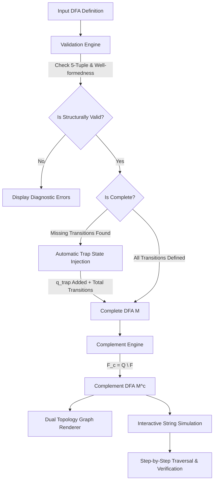

# DFA Complementer

> **An interactive Automata Theory laboratory for validating DFAs, automatically completing incomplete DFAs with trap states, generating mathematical complements, and simulating strings step-by-step.**

[](https://github.com/aryarewatkar2405-crypto/dfa-complementer/actions/workflows/ci.yml)
[](https://react.dev/)
[](https://www.typescriptlang.org/)
[](https://vitejs.dev/)
[](https://tailwindcss.com/)
[](https://js.cytoscape.org/)

---

## 📑 Table of Contents

- [Overview](#-overview)
- [The Theoretical Problem](#-the-theoretical-problem)
- [Mathematical Foundations](#-mathematical-foundations)
  - [Formal Definition of a DFA](#formal-definition-of-a-dfa)
  - [The Complement Theorem](#the-complement-theorem)
  - [Why Completeness is Mandatory](#why-completeness-is-mandatory)
  - [The Trap State ($q_{trap}$) Injection](#the-trap-state-q_trap-injection)
- [System Architecture & Pipeline](#-system-architecture--pipeline)
- [Key Features](#-key-features)
- [Project Structure](#-project-structure)
- [Interactive Demonstrations & Presets](#-interactive-demonstrations--presets)
- [Handling of Complex Edge Cases](#-handling-of-complex-edge-cases)
- [Tech Stack](#-tech-stack)
- [Getting Started](#-getting-started)
  - [Prerequisites](#prerequisites)
  - [Installation](#installation)
  - [Development Server](#development-server)
  - [Production Build](#production-build)
  - [Testing & Quality Assurance](#testing--quality-assurance)
- [Deploy to Vercel](#-deploy-to-vercel)
- [Continuous Integration (CI/CD)](#-continuous-integration-cicd)
- [Browser Compatibility](#-browser-compatibility)
- [Academic Relevance](#-academic-relevance)
- [Author & License](#-author--license)

---

## 🔬 Overview

**DFA Complementer** is an academic-grade, visual verification workbench designed for computer science students, researchers, and automata theory educators. 

In standard textbook curricula (Formal Languages & Automata Theory / Theory of Computation), students frequently encounter the rule that regular languages are closed under complementation ($L^c = \Sigma^* \setminus L$). However, constructing $M^c$ by simply inverting accept states on an **incomplete** DFA produces mathematically incorrect machines.

This tool solves this by providing a complete, automated verification pipeline:
1. **Validates** formal 5-tuple structural correctness.
2. **Detects missing transitions** across all symbols $\Sigma$.
3. **Automatically completes** the DFA by injecting and wiring a designated Dead/Trap state ($q_{trap}$).
4. **Computes the exact mathematical complement** $M^c = (Q, \Sigma, \delta, q_0, Q \setminus F)$.
5. **Provides visual side-by-side comparison** and step-by-step interactive string traversal simulation.

---

## ⚠️ The Theoretical Problem

Given an alphabet $\Sigma = \{0, 1\}$ and a language $L = \{ w \in \Sigma^* \mid w \text{ begins with } "01" \}$:

Consider an incomplete DFA with states $\{q_0, q_1, q_2\}$:
- $\delta(q_0, 0) = q_1$ *(transition on 1 is omitted)*
- $\delta(q_1, 1) = q_2$ *(transition on 0 is omitted)*
- $\delta(q_2, 0) = q_2, \delta(q_2, 1) = q_2$
- $F = \{q_2\}$

If a student naively swaps accept states ($F' = \{q_0, q_1\}$) **without completing the DFA**:
- String `10` starts at $q_0$. When reading `1`, no transition exists; execution halts/crashes.
- Since $q_0$ is in $F'$, the string `10` is not properly categorized, and the empty prefix might be falsely accepted while valid strings fail.
- **True complement behavior**: `10` does NOT begin with `01`, so `10` **must be accepted by $L^c$**.
- **Correct approach**: The missing transition $\delta(q_0, 1)$ must lead to a trap state $q_{trap}$. In $M^c$, $q_{trap}$ becomes an **accepting state**, correctly accepting `10`.

---

## 📐 Mathematical Foundations

### Formal Definition of a DFA
A Deterministic Finite Automaton (DFA) is formally defined as a 5-tuple:
$$M = (Q, \Sigma, \delta, q_0, F)$$

Where:
- $Q$ is a finite, non-empty set of states.
- $\Sigma$ is a finite input alphabet.
- $\delta: Q \times \Sigma \to Q$ is the total transition function.
- $q_0 \in Q$ is the unique start state.
- $F \subseteq Q$ is the set of final (accepting) states.

The extended transition function $\hat{\delta}: Q \times \Sigma^* \to Q$ is defined inductively:
$$\hat{\delta}(q, \varepsilon) = q$$
$$\hat{\delta}(q, wa) = \delta(\hat{\delta}(q, w), a) \quad \text{for } w \in \Sigma^*, a \in \Sigma$$

The language accepted by $M$ is:
$$L(M) = \{ w \in \Sigma^* \mid \hat{\delta}(q_0, w) \in F \}$$

### The Complement Theorem
**Theorem:** *The class of Regular Languages is closed under complementation.*

For any regular language $L \subseteq \Sigma^*$, its complement is defined as:
$$L^c = \Sigma^* \setminus L = \{ w \in \Sigma^* \mid w \notin L \}$$

If $M = (Q, \Sigma, \delta, q_0, F)$ is a **complete** DFA that accepts $L$, then the DFA:
$$M^c = (Q, \Sigma, \delta, q_0, F^c) \quad \text{where } F^c = Q \setminus F$$
accepts exactly $L^c$.

### Why Completeness is Mandatory
For the bijection between computation paths and strings $w \in \Sigma^*$ to hold, $\hat{\delta}(q_0, w)$ must be well-defined for **every** string $w \in \Sigma^*$. If $\delta$ is partial, there exist strings $u$ such that $\hat{\delta}(q_0, u)$ is undefined. Such strings are rejected by $M$ due to transition failure rather than ending in a non-accepting state.

Inverting $F \to Q \setminus F$ on a partial DFA fails to accept these undefined paths because the machine still crashes before reaching an accepting state.

### The Trap State ($q_{trap}$) Injection
To make $\delta$ total without changing $L(M)$:
1. Introduce a new state $q_{trap} \notin Q$.
2. Update state set: $Q' = Q \cup \{q_{trap}\}$.
3. Define total transition function $\delta': Q' \times \Sigma \to Q'$:
   $$\delta'(q, a) = \begin{cases} \delta(q, a) & \text{if } \delta(q, a) \text{ is defined} \\ q_{trap} & \text{if } \delta(q, a) \text{ is undefined} \\ q_{trap} & \text{if } q = q_{trap} \end{cases}$$
4. Start and accept sets remain $q_0' = q_0$ and $F' = F$.

Now $M' = (Q', \Sigma, \delta', q_0, F')$ is complete and $L(M') = L(M)$.
Taking the complement yields:
$$(M')^c = (Q', \Sigma, \delta', q_0, Q' \setminus F)$$
where $q_{trap} \in (Q' \setminus F)$, guaranteeing that all previously rejected invalid branches are formally accepted.

---

## 🔄 System Architecture & Pipeline



---

## ✨ Key Features

| Feature | Description |
| :--- | :--- |
| **Interactive Matrix Editor** | Live grid editor with dynamic state/symbol chips, validation flags, and JSON import/export. |
| **Automated Trap Engine** | Automatically detects missing $\delta(q, a)$ mappings and synthesizes a self-looping trap state with 1-click completion. |
| **Mathematical Inversion** | Instant formal complement generation with exact state-partitioning verification ($F^c = Q \setminus F$). |
| **Cytoscape Topology Visualizer** | Bespoke 2D automata graph layout supporting layered BFS hierarchy, bidirectional curve separation, and dynamic self-loop routing. |
| **Step-by-Step String Simulator** | Step-by-step playback with forward, pause, restart, and speed control, displaying active transitions and tape visualization. |
| **Batch Test Suite** | Evaluates multiple test strings simultaneously against both $M$ and $M^c$ to verify $L(M) \cap L(M^c) = \emptyset$ and $L(M) \cup L(M^c) = \Sigma^*$. |
| **Split-View Comparison** | Side-by-side visualization comparing the original, completed, and complemented state transition graphs with state diff matrices. |
| **Viva Presentation Mode** | 6-step guided walkthrough covering DFA definition, missing transition audit, trap addition, complement inversion, and runtime proof. |

---

## 📂 Project Structure

```
dfa-complementer/
├── .github/
│   └── workflows/
│       └── ci.yml               # Automated GitHub Actions CI workflow
├── public/                      # Static web assets
├── src/
│   ├── assets/                  # Icons and branding media
│   ├── components/
│   │   ├── editor/              # Transition matrix editor & validation badges
│   │   │   ├── DFAEditor.tsx
│   │   │   └── ValidationPanel.tsx
│   │   ├── explanation/         # Mathematical formula & LaTeX proof modal
│   │   │   └── MathModal.tsx
│   │   ├── layout/              # Navbar, Hero section & Presentation Mode modal
│   │   │   ├── HeroSection.tsx
│   │   │   ├── Navbar.tsx
│   │   │   └── PresentationModeModal.tsx
│   │   ├── simulator/           # Traversal animator & batch string test harness
│   │   │   └── StringTester.tsx
│   │   └── visualizer/          # Cytoscape graph composition engine & split view
│   │       ├── CompareView.tsx
│   │       ├── DFAVisualizer.tsx
│   │       └── dfaGraphEngine.ts
│   ├── core/                    # Pure automata mathematical operations
│   │   ├── __tests__/           # Unit test suite verifying formal proofs
│   │   │   └── dfaOperations.test.ts
│   │   ├── dfaOperations.ts     # Complete, complement, simulate & validate algorithms
│   │   └── dfaPresets.ts        # Standard automata presets (Parity, Modulo 3, etc.)
│   ├── types/                   # Formal TypeScript interface declarations
│   │   └── dfa.ts
│   ├── App.tsx                  # Root application layout container
│   ├── index.css                # Custom CSS design system & typography
│   └── main.tsx                 # React DOM mount entry
├── .gitignore                   # Production git exclusion rules
├── package.json                 # Project dependencies and script declarations
├── tailwind.config.js           # Tailwind CSS theme extension
├── tsconfig.json                # TypeScript project references
├── vercel.json                  # Vercel SPA routing and build configuration
└── vite.config.ts               # Vite build configuration
```

---

## 🧪 Interactive Demonstrations & Presets

The laboratory includes pre-configured automata models demonstrating theoretical concepts:

1. **Starts with "01" (Incomplete DFA)**:
   - Demonstrates how omitted transitions on $q_0 \xrightarrow{1}$ and $q_1 \xrightarrow{0}$ trigger trap state creation.
2. **Odd Number of 1s (2-State Parity)**:
   - Symmetric binary machine demonstrating cyclic state inversion.
3. **Ends with "10" (Suffix Recognizer)**:
   - Multi-path backward transition routing.
4. **Binary Modulo 3 ($n \pmod 3 = 0$)**:
   - 3-state arithmetic cycle layout.
5. **Contains Substring "aba"**:
   - Demonstrates arbitrary alphabet support ($\Sigma = \{a, b\}$) and non-numeric states.

---

## 🛡️ Handling of Complex Edge Cases

- **Empty String ($\varepsilon$)**: Correctly evaluated against $q_0 \in F$ vs $q_0 \in F^c$.
- **Alphabet Normalization**: Automatically strips whitespace and rejects multi-character or duplicate symbols.
- **Unreachable / Disconnected States**: Preserves formal algebraic structure during complementation without invalid memory exceptions.
- **Parallel Transitions**: Automatically merges matching edge pairs (e.g. $q_0 \xrightarrow{0} q_1$ and $q_0 \xrightarrow{1} q_1$) into clean comma-delimited labels (`0, 1`).
- **All-Reject / All-Accept Machines**: Complements $\emptyset \leftrightarrow \Sigma^*$.

---

## 💻 Tech Stack

- **UI Framework**: [React 19](https://react.dev/)
- **Language**: [TypeScript](https://www.typescriptlang.org/)
- **Bundler & Dev Server**: [Vite 8](https://vitejs.dev/)
- **Styling**: [Tailwind CSS 3.4](https://tailwindcss.com/)
- **Graph Visualization**: [Cytoscape.js](https://js.cytoscape.org/)
- **Animation**: [Framer Motion](https://www.framer.com/motion/)
- **Icons**: [Lucide React](https://lucide.dev/)
- **Testing**: [Vitest](https://vitest.dev/)
- **Linter**: [Oxlint](https://oxc.rs/)

---

## 🚀 Getting Started

### Prerequisites
- **Node.js**: `v20.x` or higher
- **npm**: `v10.x` or higher

### Installation
Clone the repository and install dependencies:
```bash
git clone https://github.com/aryarewatkar2405-crypto/dfa-complementer.git
cd dfa-complementer
npm ci
```

### Development Server
Start the local development server with hot module reloading:
```bash
npm run dev
```
Open [http://localhost:5173](http://localhost:5173) in your browser.

### Production Build
Compile and bundle the production-ready assets:
```bash
npm run build
```
The optimized bundle will be generated in the `dist/` directory.

### Testing & Quality Assurance
Run linting, type-checking, and the automated mathematical test suite:
```bash
# Run fast Oxlint rules
npm run lint

# Run TypeScript compiler type checking
npm run typecheck

# Run unit tests
npm test
```

---

## 🚀 Deploy to Vercel

This repository is pre-configured with [`vercel.json`](./vercel.json) for 1-click deployment with zero extra configuration.

### Deploying via Vercel Dashboard:
1. Push your latest changes to GitHub.
2. Navigate to [Vercel Dashboard](https://vercel.com/dashboard).
3. Click **"Add New..."** $\to$ **"Project"**.
4. Import the `dfa-complementer` repository from your GitHub account.
5. Vercel will automatically detect **Vite** as the framework:
   - **Build Command**: `npm run build`
   - **Output Directory**: `dist`
   - **Install Command**: `npm ci`
6. Click **"Deploy"**.

Future pushes to the `main` branch will automatically trigger production deployments.

---

## 🔄 Continuous Integration (CI/CD)

Automated testing and validation are executed via GitHub Actions on every push and pull request to `main`.

Workflow steps configured in [`.github/workflows/ci.yml`](./.github/workflows/ci.yml):
1. **Repository Checkout** (`actions/checkout@v4`)
2. **Node.js Environment Setup** (`actions/setup-node@v4` with npm cache)
3. **Clean Dependency Installation** (`npm ci`)
4. **Code Quality Linting** (`npm run lint`)
5. **Static Type Checking** (`npm run typecheck`)
6. **Mathematical Logic Testing** (`npm test`)
7. **Production Build Verification** (`npm run build`)

---

## 🌐 Browser Compatibility

Tested and optimized for modern evergreen browsers:
- Google Chrome $\ge$ 110
- Mozilla Firefox $\ge$ 110
- Apple Safari $\ge$ 16.4
- Microsoft Edge $\ge$ 110

---

## 🎓 Academic Relevance

This project was built as an educational tool for courses in:
- **Theory of Computation (TOC)**
- **Formal Languages and Automata Theory (FLAT)**
- **Design and Analysis of Algorithms (DAA)**
- **Compiler Design**

---

## 👤 Author & License

- **Author**: Arya Rewatkar ([@aryarewatkar2405-crypto](https://github.com/aryarewatkar2405-crypto))
- **Repository**: [https://github.com/aryarewatkar2405-crypto/dfa-complementer.git](https://github.com/aryarewatkar2405-crypto/dfa-complementer.git)
- **License**: MIT License
